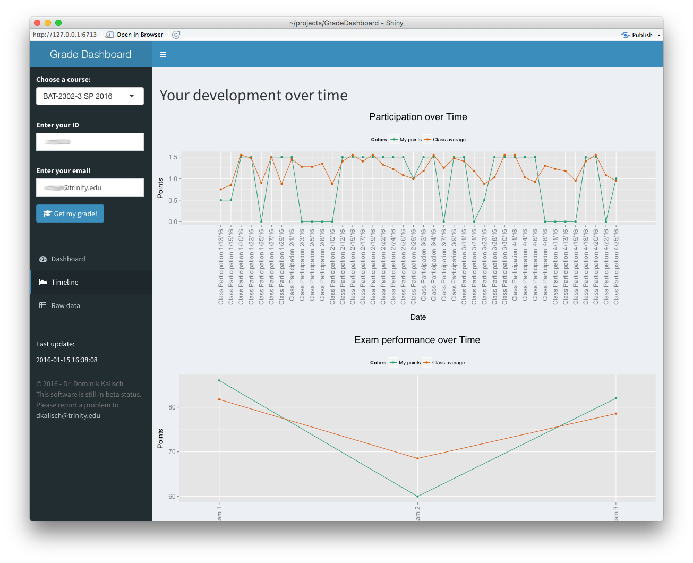

<p align="center">
    <a href="https://www.gratipay.com/Shields/">
        
    </a>
    <a href="https://npmjs.org/package/gh-badges">
        
    </a>
    <a href="https://travis-ci.org/badges/shields">
        
    </a>
    <a href="https://travis-ci.org/badges/shields">
        
    </a>
</p>


# GradeDashboard
## About
A professor get often asked what the current grade of a student is and also how this grade is composed. Typically this is not difficult since it is just an addition of the sub grades of a student. For example, the course grade might be composed based on quizzes, exams and class participation. Whereas each part again consist of multiple points like three exams, ten quizzes and 40 days of participation. However, for a student this composition is difficult to understand and not very transparent, since most of the time the student only sees the course grade, sometimes also the individual exams grades.

In order to make the evolution of a course grade more transparent, I developed a shiny dashboard, that takes an Excel document as input and visualize the individual grade components.

## Why Excel?
The reason why I choose Excel is, that it is for the most professors the tool of choice when it comes to writing down the grades. I wanted to develop something, that doesn't interfeer with the common workflow, but instead give a benefit to the professor and the student.

## Requirements
In order to use the dashboard, one need to have a server with R and shiny installed. I furthermore utilize the following R libraries:

```r
library(xlsx) # For reading Excel files
library(dplyr) # For data handling
library(ggplot2) # For data visualization
library(reshape2) # For data manipulation
library(grid) # For plot adjustments
```

The Excel files need to have the structure as the example ones under `data/`, and need to be stored under data.

## Usage
The dashboard reads every excel sheet in the `data/` folder and makes the content accessable for the student. In order to so details of the grade, the student must provide his student ID number and the corresponding email address. After providing this information, the dashboard will present the grade. Under the 'Dashboard' section, the student sees the components compared to the best possible outcome including a color and and icon feedback (red and a fire for under passing performance, yellow and a lightning for performance that might endanger a passing grade and green). This helps the student to understand the areas he needs to focus on.


At the 'Timeline' section the student sees his performance over time compared to the class average. This helps the student to understand the evolution of a grade over time and puts his performance into the perspective of the class.



A professor can either sync the Excel file to the `data/` location or can update the file directly on the server

## Settings
In oder to function properly, some settings need to be set. The example file has two sheets that are required by the dashboard: 'Settings' and 'Reference'

### Settings tab
This sheet provides the dashboard with all necessary settings. 

<dl>
    <dt>Number of Students</dt>
    <dd>The number of students in class</dd>

    <dt>Row number max points</dt>
    <dd>Row number which holds the information of the maximal number of points that can be reached for a particular grade part</dd>

    <dt>Good</dt>
    <dd>The ratio above which the grade is to be considered good (green) [numeric between 0 and 1]</dd>

    <dt>Average</dt>
    <dd>The ratio above which the grade is to be considered averarge. (yellow) [numeric between 0 and 1]</dd>

    <dt>Poor</dt>
    <dd>The ratio above which the grade is to be considered poor. (red) [numeric between 0 and 1]</dd>

    <dt>Exam</dt>
    <dd>Does this class has a grade portion from exams? [yes or no]</dd>

    <dt>Assignment</dt>
    <dd>Does this class has a grade portion from assignments? [yes or no]</dd>

    <dt>Quiz</dt>
    <dd>Does this class has a grade portion from quizzes? [yes or no]</dd>

    <dt>Class Participation</dt>
    <dd>Does this class has a grade portion from class participation? [yes or no]</dd>

    <dt>Extra Points</dt>
    <dd>Does this class has a grade portion from extra points? [yes or no]</dd>

    <dt>Presentation</dt>
    <dd>Does this class has a grade portion from presentations? [yes or no]</dd>

    <dt>Homework</dt>
    <dd>Does this class has a grade portion from homework? [yes or no]</dd>
</dl>

### Reference tab
This sheet includes some definitions for the letter grade brackets. These definitions are used in the 'Grade' sheet to determine the letter grade based on the course total percentages.

### Summary tab
This tab gives an overview of the overall grade average and median, as well as the individual exam grade averages and medians. This tab is only used by the professor and can be changed according to the own needs

### Visualization
This tab gives shows a grade distribution of the letter grade. This tab is only used by the professor and can be changed according to the own needs.

# ToDo
The following things need to be done:

- Fix the layout if a grade component is not used
- Reading support for files from github
- Password protection
- Additional KPI's?

# License
The software was developed by Dominik Kalisch and published under the [Creative Commons Attribution-NonCommercial-ShareAlike 4.0 International license](http://creativecommons.org/licenses/by-nc-sa/4.0/deed.en). By downloading the software you agree to this license.